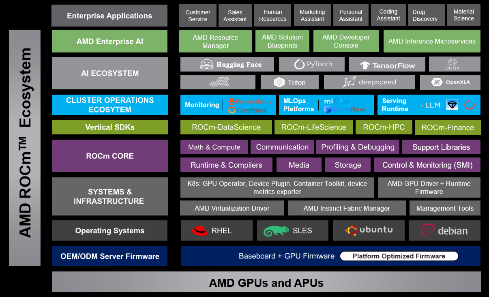
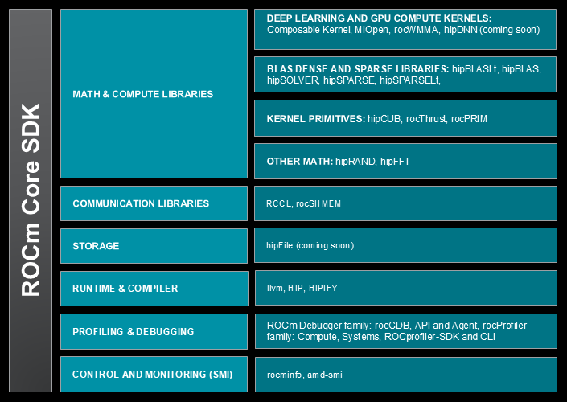

.. meta::
   :description: Learn what ROCm is – AMD's open software stack for GPU programming, including runtimes, compilers, libraries, and tools for Linux and Windows.
   :keywords: ROCm, AMD, GPU computing, ROCm Core SDK, ROCm components, TheRock, ROCm architecture, HPC, AI, machine learning, ROCm runtime

*******************************
AMD ROCm |ROCM_VERSION| preview
*******************************

AMD ROCm is an open, modular, and high‑performance GPU software ecosystem
— built collaboratively with the community, maintained transparently, and
optimized for consistent, scalable performance across data centers,
workstations, and edge devices.

ROCm |ROCM_VERSION| is a technology preview release built with
`TheRock <https://github.com/ROCm/TheRock>`__, AMD’s new open build and release
system.
This preview introduces a new modular build workflow that will become standard
in the near future. The existing monolithic release process will continue to be
used in the production ROCm 7.0 stream during this transition period until the
modular workflow fully replaces it. See the :ref:`release notes
<preview-stream-note>` for more information.

What is ROCm?
=============

ROCm is AMD’s open software stack for GPU‑accelerated computing. It provides
the tools needed to program AMD GPUs — including runtimes, compilers,
performance and system utilities, and optimized math and compute libraries. The
wider ROCm ecosystem includes ROCm‑enabled HPC applications and deep learning
frameworks such as PyTorch.

**Some key features:**

* **Open source** -- Transparent development driven by community feedback
* **Cross‑platform** -- Supports Linux and Windows environments
* **Comprehensive** -- End‑to‑end toolchain from compilers to libraries
* **Performance‑focused** -- Tuned for AMD Instinct™, AMD Radeon™, and AMD Ryzen™ devices

ROCm supports AMD GPU architectures spanning data center, workstation, and APU
categories. TheRock enables a unified ROCm user‑space experience across
devices.

* **AMD Instinct GPUs** -- Purpose‑built for large‑scale compute, AI training, and HPC workloads.

* **AMD Radeon GPUs and AMD Ryzen AI APUs** -- Designed for workstations, desktop computing, and edge AI applications.

.. note::

   This release supports a limited number GPU models. Hardware support will be
   expanded with future releases.

What’s changing
===============

ROCm is evolving to improve flexibility, maintainability, and
use‑case alignment.

* **Leaner core** – The Core SDK focuses on essential runtime and development components.
* **Use case‑specific expansions** – Optional domain‑specific SDKs for AI, data science, and HPC.
* **Modular installation** – Install only the components required for your workflow.

This approach streamlines installation, reduces footprint, and accelerates
innovation through independently released packages.

ROCm Core SDK
-------------

The ROCm Core SDK provides the foundational components that power the ROCm
ecosystem — runtimes, compilers, math libraries, and system utilities for GPGPU
computing.

The TheRock infrastructure keeps these components modular, consistent, and easy
to integrate across configurations.

Getting started
===============

* See the release notes -- :doc:`/about/release-notes` -- to learn about the latest
  changes and current system compatibility information.

* Follow :doc:`/install/rocm` to set up ROCm on your system.
