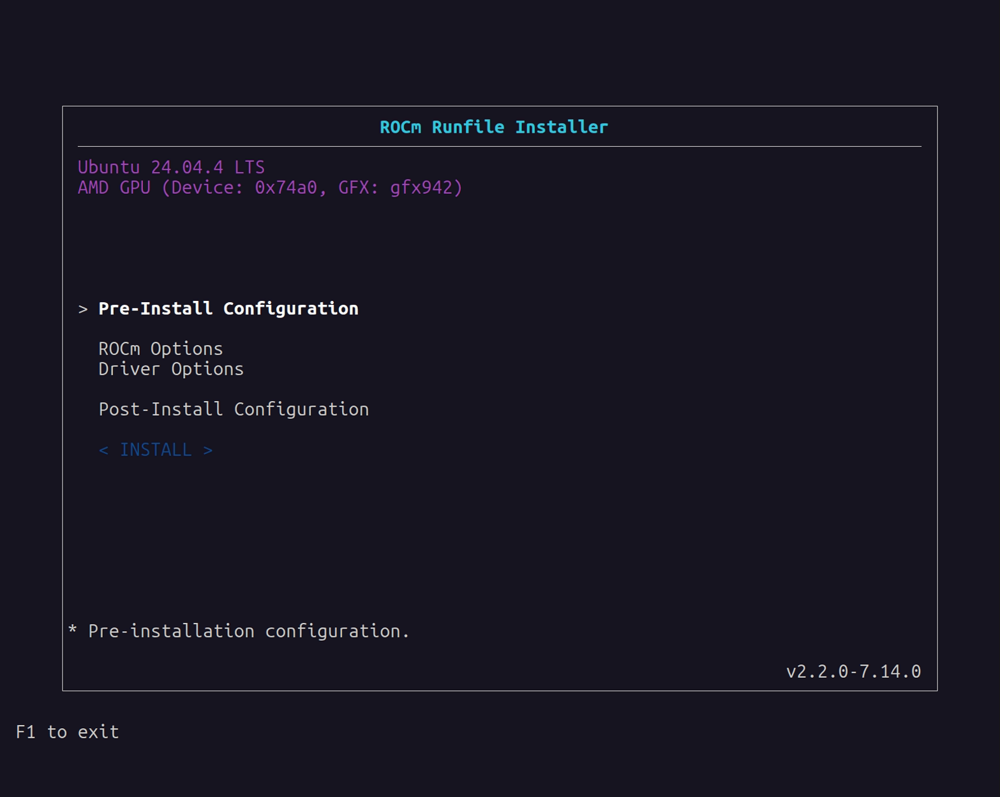
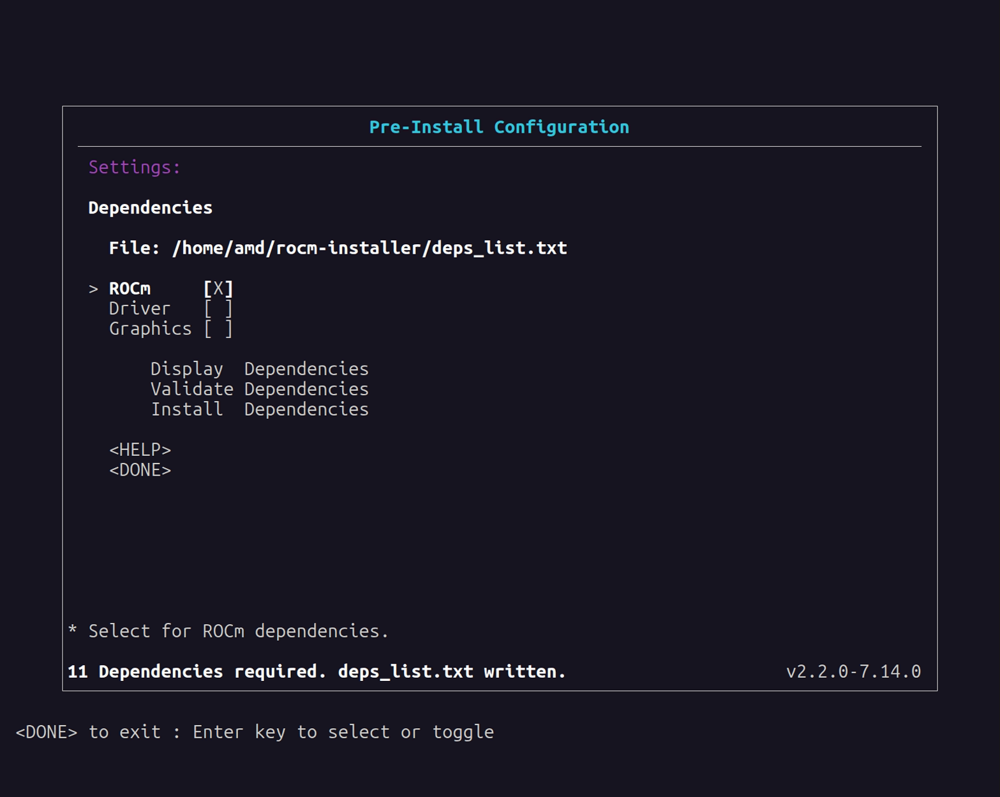
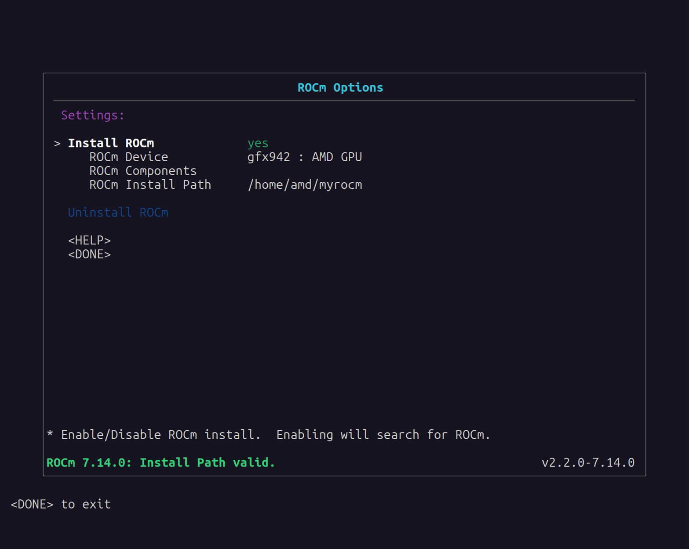
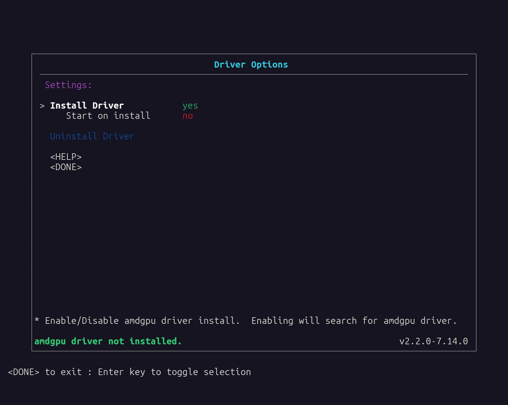
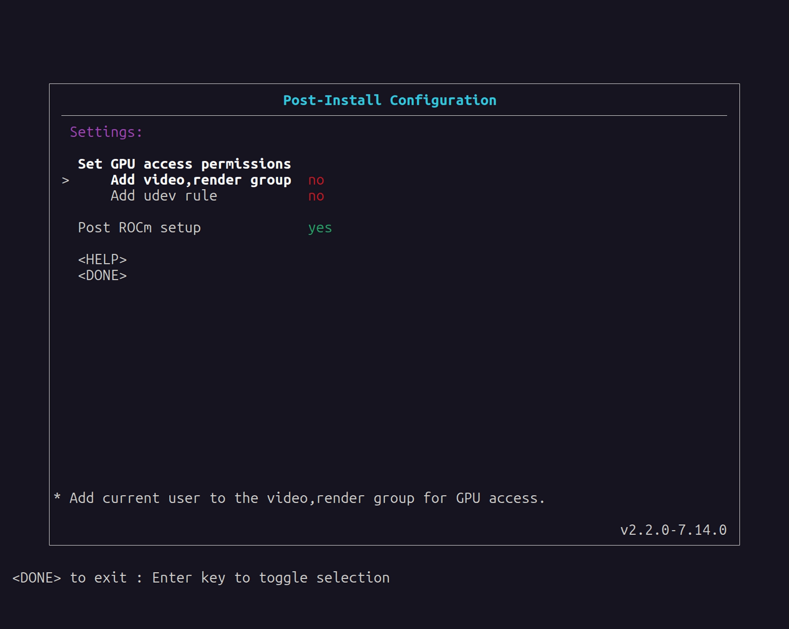

.. meta::
  :description: How to use the ROCm Runfile Installer
  :keywords: ROCm installation, AMD, ROCm, tools, Runfile installer

**********************
ROCm Runfile Installer
**********************

The ROCm Runfile Installer installs ROCm, the AMD GPU Driver,
or a combination of the two on a system with or without
network or internet access. Unlike all other installation methods, the ROCm Runfile Installer
can install ROCm and the AMD GPU Driver without using a native Linux package management system.

The key advantage of using the ROCm Runfile Installer is its offline installation support.
Many system environments have network or internet access restrictions, making installation via
normal package management difficult. Furthermore, some installation environments might also have general
restrictions on package management usage. Therefore, the ROCm Runfile Installer lets you perform
a completely self-contained ROCm software installation.

The ROCm Runfile Installer includes these features:

* An optional easy-to-use user interface for configuring the installation
* An optional command line interface for the installation
* Offline ROCm and AMD GPU Driver installation (requires the prior installation of dependencies)
* Packageless ROCm and AMD GPU Driver install without native package management
* A single self-contained installer for all supported Linux distributions
* Multi-architecture GPU support with selective installation and uninstall
* Flexible component selection (core, development tools, SDK, OpenCL)
* Graphics support option for Mesa/OpenGL workloads
* Configurable installation location for the ROCm install

Prerequisites
=============

The ROCm Runfile Installer requires the following configuration:

* Installation of dependency requirements for the ROCm runtime
* Installation of dependency requirements for the AMD GPU Driver (optional)
* Sufficient storage space for the installation (100 GB of free space recommended)
* A supported Linux distribution

.. _dependency-requirements:

Dependency requirements
=======================

The ROCm components contained within the ROCm Runfile installer have a specific set of libraries, frameworks, and other elements
that must be pre-installed on the system before you can use ROCm after the installation. Similarly, the
inclusion of the AMD GPU Driver as part of the installation also requires specific libraries that must be pre-installed. ROCm Runfile installer users
must pre-install the list of required first-level dependencies.

To install the pre-install dependencies, use one of two methods:

* Manual installation
* The ROCm Runfile Installer

Manual installation
-------------------

You can determine the dependent packages from the ROCm
Runfile Installer **Pre-Install Configuration Settings** menu
in the GUI or from the command line by using the ``deps=list rocm`` argument
for ROCm or the ``deps=list amdgpu`` argument for the AMD GPU Driver. This list, which indicates all packages
required for the ROCm runtime or the AMD GPU Driver, is displayed and saved to a
file named ``deps_list.txt`` in the root ``rocm-installer`` directory. The required libraries, frameworks, and other components
within the required packages must be on the system when running ROCm or installing the AMD GPU Driver.
Users can manually install the required packages in the list using any method.

The list of packages that is displayed and saved is not directly usable by the package manager.
Each line indicates the name of the package or versioning required to meet the dependency requirement.
Some dependencies might show multiple packages separated by the ``|`` symbol, meaning that any package from the list satisfies
the package dependency. For example, the ``libgcc-dev`` dependency might be ``libgcc-5-dev | libgcc-7-dev``, meaning
that either ``libgcc-5-dev`` or ``libgcc-7-dev`` can be installed to satisfy the corresponding dependency.

System administrators might prefer a manual installation process when deploying ROCm across a multi-node
cluster environment, where a base operating system image
is prepared and applied. This base OS image might have the dependency requirements pre-installed.

ROCm Runfile Installer
----------------------

For single-system environments, users can choose to have the ROCm Runfile Installer automatically install the
dependency requirements as part of the pre-installation stage for ROCm or the AMD GPU Driver. Any missing dependency requirements can
be installed using the **Install Dependencies** option of the **Pre-Install Configuration Settings** menu
in the GUI or from the command line using the ``deps=install rocm`` or ``deps=install amdgpu`` argument.

.. note::

   The ROCm Runfile Installer requires a network or internet connection to install the dependency requirements.

Supported Linux distributions
=============================

The ROCm Runfile Installer supports the following Linux distributions and versions:

* Ubuntu: 22.04, 24.04, 26.04
* RHEL: 8.10, 9.4, 9.6, 9.8, 10.0, 10.2
* SLES: 15.7, 16.0
* Debian: 12, 13
* Oracle Linux: 8.10, 9.7, 10.1
* Rocky Linux: 9.7

.. important::

   The new ROCm runfile installer is a universal installer that supports all listed distributions from a single
   ``.run`` file. There is no need to download distribution-specific builds as was required in previous versions.

Getting started
===============

The ROCm Runfile Installer is distributed as a self-extracting ``.run`` file.
To install ROCm, launch the installer from any directory on the system.

Downloading the ROCm Runfile Installer
--------------------------------------

Download the ROCm Runfile Installer from `repo.radeon.com <https://repo.radeon.com/>`_ using the following command:

.. code-block:: shell

   wget https://repo.radeon.com/rocm/installer/rocm-runfile-installer/rocm-rel-<rocm-version>/<installer-file>

Substitute values specific to your installation for the following placeholders:

.. code-block:: shell

   <rocm-version>    = ROCm version number for the installer (for example, 7.14)
   <installer-file>  = The installer .run file

For example, to download ROCm 7.14 of the ROCm Runfile Installer:

.. code-block:: shell

   wget https://repo.radeon.com/rocm/installer/rocm-runfile-installer/rocm-rel-7.14/rocm-installer-7.14.0-6.run

Running the ROCm Runfile Installer
----------------------------------

After downloading the ROCm Runfile Installer, run it from a terminal using
:ref:`gui-install` or :ref:`command-line-install`. See the sections below for more details.

You can obtain help, version, architecture, or component information using the following installer ``.run`` file argument options:

.. code-block:: shell

   bash rocm-installer-7.14.0-6.run help
   bash rocm-installer-7.14.0-6.run version
   bash rocm-installer-7.14.0-6.run buildinfo
   bash rocm-installer-7.14.0-6.run gfx=list
   bash rocm-installer-7.14.0-6.run compo=list

The ``help``, ``version``, ``buildinfo``, ``gfx=list``, and ``compo=list`` commands run without extracting the installer contents.
For all other argument options, or if no arguments are specified, the installer ``.run`` file self-extracts
to the current working directory where the ``.run`` file is executing.
The self-extraction process creates a new directory named ``rocm-installer`` containing the content
and tools required for the installation. The ``rocm-installer`` directory also includes a ``logs``
directory for recording the installation process. For more information, see :ref:`log-files` below.

.. note::

   The installer self-extraction process might take a significant amount of time due to the size of the installer content and the decompression process.

Install methods
===============

The ROCm Runfile Installer provides two methods for running the ROCm installation:

* :ref:`gui-install`: The GUI installation includes a visual interface for configuring the installation,
  letting you specify the pre- and post-installation requirements. In addition, the GUI provides
  feedback and guidance for setting up the installation. This method is recommended for new
  and intermediate installer users.
* :ref:`command-line-install`: The command line interface installation method provides a direct terminal-based approach for
  configuring and running the installation. This method is recommended for more advanced installer users and automation scenarios.

.. _gui-install:

GUI install
===========

Launch the GUI-based installation of the ROCm Runfile Installer from the terminal command line without arguments as follows:

.. code-block:: shell

   bash rocm-installer-7.14.0-6.run

GUI
---

Use the Runfile Installer GUI to configure the installation, from the pre- to post-install options.

Starting from the **Main** menu, the user interface contains multiple menus and sub-menus for each stage
of the installation process.

Main menu
^^^^^^^^^

The **Main** menu is the installation starting point.

Pre-Install Configuration Settings menu
^^^^^^^^^^^^^^^^^^^^^^^^^^^^^^^^^^^^^^^^

The **Pre-Install Configuration Settings** menu is an optional menu used to configure pre-installation
requirements before installation. The pre-installation settings relate to the dependent libraries
and packages required by the ROCm runtime or the AMD GPU Driver.

* **File**

  **File** displays the location of the ``deps_list.txt`` file. This file is based
  on the combination of selected dependencies using the **ROCm**, **Driver**, and **Graphics** checkboxes and either
  **Display Dependencies** or **Validate Dependencies**. If **Display Dependencies** is selected, ``deps_list.txt``
  includes a list of all required dependencies. If **Validate Dependencies** is selected,
  ``deps_list.txt`` contains only the missing dependencies on the system that still require installation.
  The **File** field is initially blank until **Display Dependencies** or **Validate Dependencies** is selected.
  Use the **Install Dependencies** to install the required dependencies on the system.

* **ROCm** / **Driver**

  The **ROCm** and **Driver** checkboxes are used to select which dependencies you want to display, validate, or install.

* **Graphics**

  The **Graphics** checkbox enables mixed graphics and compute support for Mesa/OpenGL workloads.
  This is an option for non-Instinct GPUs such as AMD Radeon or Ryzen GPUs/APUs. When checked, the installer includes the
  ``amdgpu-lib`` package.

* **Display Dependencies**

  **Display Dependencies** lists all required (Debian or RPM) packages that must be pre-installed on the system.
  These packages are required by ROCm or the AMD GPU Driver being installed by a particular ROCm Runfile Installer version.

  .. note::

     The required packages are listed in the ``deps_list.txt`` file and can be installed separately from the ROCm Runfile Installer.

* **Validate Dependencies**

  **Validate Dependencies** verifies which required packages are currently installed on the system where
  ROCm or the AMD GPU Driver is being installed. It displays which packages from the required packages list are missing.

  .. note::

     The missing packages are listed in the ``deps_list.txt`` file.

* **Install Dependencies**

  If the installer is running on the system where ROCm or the AMD GPU Driver will be installed, you can choose to install
  any missing dependencies using the **Install Dependencies** option.

  .. note::

     **Install Dependencies** is only intended for a system with network or internet access. For offline installation
     using the ROCm Runfile Installer, you must manually install the required packages.
     For more details, see the :ref:`dependency-requirements` section.

ROCm Options menu
^^^^^^^^^^^^^^^^^

The **ROCm Options** menu can include or exclude ROCm from the installation and provides access to device/architecture and component selection.

* **Install ROCm**

  This field indicates whether to include ROCm components in the installation. If this field is set to ``yes``,
  ROCm installation is enabled and the Runfile Installer searches for any existing ROCm installations at the currently set
  **ROCm Install Path**. If a previous ROCm installation is detected, the **Uninstall ROCm** field becomes selectable.

* **ROCm Device**

  This submenu allows you to select which GPU architectures to install. You can choose specific architectures
  (gfx942, gfx1100, gfx950, and so on), multiple architectures, or all available architectures. The installer will list the
  currently auto-detected GPU and associated architecture by default.

  .. image:: ../data/how-to/rocm-runfile-rocm-device-3a.png
   :width: 800
   :alt: The ROCm Device user interface menu for the ROCm Runfile Installer

* **ROCm Components**

  This submenu allows you to select which ROCm component categories to install:

  * **core**: Core ROCm components
  * **core-dev**: Core development components
  * **dev-tools**: Developer tools
  * **core-sdk**: Core SDK components
  * **opencl**: OpenCL runtime

  .. image:: ../data/how-to/rocm-runfile-rocm-components-3b.png
   :width: 800
   :alt: The ROCm Components user interface menu for the ROCm Runfile Installer

* **ROCm Install Path**

  If **Install ROCm** is set to ``yes``, the **ROCm Install Path** field can set the full path to
  the directory where ROCm will be installed. The default location is ``/opt``, which results in a ``/opt/rocm/core-x.y.z`` installation.

  When **ROCm Install Path** is set to a new path, the installer validates the new directory location.
  If the directory exists, the ROCm installation can proceed. If an invalid location is specified,
  the ROCm installation will not be allowed.

* **Uninstall ROCm**

  This field is only available if previous Runfile ROCm installations are discovered on the system
  where ROCm is being installed, based on the currently selected **ROCm Install Path** location.
  The installer only lists previous installation locations that are on the current install path.
  If any installation locations are present on this path, they can be selected for uninstall.

  The installer indicates the type of installation as follows:

  * **P** (Package manager): Package manager installation that matches the ROCm version for the Runfile Installer. In this case, uninstall is not allowed.
  * **C** (Runfile conflict): Runfile installation that matches the ROCm version for the Runfile Installer. The conflicting installation can be uninstalled.
  * **R** (Runfile): Runfile installation that differs from the ROCm version for the Runfile Installer. The installation can be uninstalled.

  **Uninstall ROCm** is for a single ROCm instance at a time and is only available for Runfile installs.
  Package manager installs of ROCm cannot be uninstalled by the Runfile installer and must be uninstalled manually
  using the package management application.

  .. note::

     For multi-architecture installs from the current **ROCm Install Path**, the GUI interface will uninstall all architectures.
     To uninstall specific GPU architectures, use the command line interface for uninstall.

Driver Options menu
^^^^^^^^^^^^^^^^^^^

The **Driver Options** menu can include or exclude the AMD GPU Driver from the installation.

* **Install Driver**

  This field indicates whether to include the AMD GPU Driver in the installation. If this field is set to ``yes``,
  AMD GPU Driver installation is enabled. When this field is enabled, the system is searched for any existing
  AMD GPU Driver installations. If a previous AMD GPU Driver installation is detected, the **Uninstall Driver** field becomes selectable.

  .. note::

     The AMD GPU Driver is installed for the currently running Linux kernel version. To install the AMD GPU Driver for a different kernel,
     reboot to the specific Linux kernel and reinstall the AMD GPU Driver using the runfile.

* **Start on install**

  If the **Start on install** option is enabled, the Runfile installer uses ``modprobe`` to automatically launch
  the AMD GPU Driver after installation. If a pre-existing AMD GPU Driver is already loaded on the system, the new driver will not start.
  This option can be useful for installing the driver on a system where the GPU device is newer and not yet natively
  supported as part of the upstream GPU driver for the Linux distribution.

* **Uninstall Driver**

  This field is only available if a previous Runfile install of the AMD GPU Driver is discovered on the install system.
  If a Runfile installation of the AMD GPU Driver is detected, select **Uninstall Driver** to remove it.
  Package manager installs of the AMD GPU Driver cannot be uninstalled by the Runfile installer and must be
  uninstalled manually using the package management application.

Post-Install Options menu
^^^^^^^^^^^^^^^^^^^^^^^^^

Use the **Post-Install Options** menu to optionally enable additional setup and configuration items
after the initial ROCm install.

* **Set GPU access permissions**

  This section sets the GPU access permissions after the ROCm installation.
  Typically, any ROCm component using the GPU and requiring access to GPU resources
  needs to set the access permission. For ROCm, GPU access is controlled by membership in
  the ``video`` and ``render`` groups. Membership and access to GPU resources can be set using one of two methods.

  * **Add video,render group**

    If the **Add video,render group** field is enabled, the current ``$USER`` is added to the groups
    and will be granted GPU access.

  * **Add udev rule**

    If the **Add udev rule** field is enabled, GPU access is granted to all users on the system.

  .. note::

     It's **recommended** that you enable one of the GPU access options for using ROCm.

     Only one method for adding GPU access can be selected.

* **Post ROCm setup**

  When this option is enabled, the ROCm post-install setup is performed. This includes configuring
  symbolic links and other system requirements for using ROCm and the ROCm runtime. This option is enabled by default for ROCm installations.

  .. tip::

     It's recommended that you enable the **Post ROCm setup** to guarantee proper
     functioning of the ROCm components and applications. However, advanced users
     who understand the ROCm setup might want to disable this option so they can control the
     post-installation ROCm setup for their specific environment.

Using the GUI
-------------

Start the ROCm Runfile Installer user interface from the terminal and launch the **Main** menu.
While navigating through the user interface menus, use the **Done** option to return to the previous menu.
Some menus have a **Help** option to display more information about the elements within the current menu.

Follow these steps to install ROCm and the AMD GPU Driver:

#. **(Optional)** Install dependencies:

   a. Enter the **Pre-Install Configuration** menu.
   b. Select the **ROCm** checkbox, **Driver** checkbox, or both to specify the dependency type.
   c. **(Optional)** Select the **Graphics** checkbox if you need graphics support for Mesa/OpenGL workloads.
   d. If using the installer to install missing required dependencies, select **Install Dependencies**.

      To manually install the required dependencies, select **Display Dependencies** to list
      all the dependencies or **Validate Dependencies** to only list the missing dependencies on the
      current system. Quit the installer using **DONE->F1** and separately install the required dependencies,
      which will be listed in the ``deps_list.txt`` file at the **File** location.
      After completing this task, restart the ROCm Runfile Installer and proceed to step 2.

#. Set the ROCm options:

   a. Enter the **ROCm Options** menu.
   b. Set **Install ROCm** to **yes** to include ROCm components in the installation.
   c. **(Optional)** Enter the **ROCm Device** submenu to select GPU architectures. By default, the installer auto-detects your GPU.
   d. Enter the **ROCm Components** submenu to select component categories.
   e. **(Optional)** Select **Uninstall ROCm** to uninstall a previous Runfile installation or specific architectures.
   f. Leave the **ROCm Install Path** field set to the default location (``/opt``) to install ROCm to ``/opt/rocm/core-x.y.z``
      or set the install location to a valid existing directory.

#. Set the AMD GPU Driver options:

   a. Enter the **Driver Options** menu.
   b. Set **Install Driver** to **yes** to include the AMD GPU Driver in the installation.
   c. **(Optional)** Select **Start on install** to load the driver after installation.
   d. **(Optional)** Select **Uninstall Driver** to uninstall a previous Runfile installation.

#. Set the post-install options:

   a. Set the method of enabling permission for GPU access to **Add video,render group** or **Add udev rule**.
   b. Set the **Post ROCm setup** to **yes** to include configuration of ROCm post-installation, which is recommended and enabled by default. Set to **no** to exclude the post-installation.

.. _command-line-install:

Command line install
====================

The command line install interface can be used as an alternative to the menu-based ROCm Runfile Installer GUI
to reduce user interaction during the installation and enable automation scenarios.

Run the ROCm Runfile Installer from the terminal command line as follows:

.. code-block:: shell

   bash rocm-installer-7.14.0-6.run <options>

The ``<options>`` parameter can be set to these options:

* User help/information

  * ``help``: Displays information on how to use the ROCm Runfile Installer.
  * ``version``: Displays the current version of the ROCm Runfile Installer.
  * ``buildinfo``: Display ROCm build information (theRock commit, GitHub run ID, and so on).

* Runfile options

  * ``noexec``: Disable all installer execution. Extract the ``.run`` file content only.
  * ``noexec-cleanup``: Disable cleanup after installer execution. Keep all ``.run`` extracted and runtime files.

* Dependencies

  * ``deps=<arg> <compo>``:

    * ``<arg>``:

      * ``list <compo>``: Lists the required dependencies for the install ``<compo>``.
      * ``validate <compo>``: Validates which required dependencies are installed or not installed for ``<compo>``.
      * ``install-only <compo>``: Installs the required dependencies only for ``<compo>``.
      * ``install <compo>``: Installs with the required dependencies for ``<compo>``.

    * ``<compo>``: Install component (``rocm``/``amdgpu``/``rocm amdgpu``).

* Install

  * ``rocm``: Enable ROCm components install.
  * ``amdgpu``: Enable AMD GPU Driver install.
  * ``force``: Force the ROCm and AMD GPU Driver install.
  * ``graphics``: Enable graphics support by installing ``amdgpu-lib`` for Mesa/OpenGL.
  * ``target=<directory>``: The target directory path for the ROCm components install (default: ``/opt``).
  * ``gfx=<arch>``: GPU architecture to install.

    * ``<arch>``: Architecture specification (for example, ``gfx942``, ``gfx1100``, ``gfx950``).

      Special values:

      * ``gfx=all``: Install all available architectures.
      * ``gfx=list``: Show available architectures in the installer.
      * ``gfx=list-installed``: Show currently installed architectures (checks ``/opt`` by default; use with ``target=<path>`` to check a different location).
      * ``gfx=show``: Detect and display GPU information.

    * Multiple architectures: ``gfx=gfx942,gfx950`` (comma-separated).
    * If not specified, auto-detects GPU and installs matching architecture.

  * ``compo=<component_list>``: Comma-separated list of ROCm components to install.

    * Available components: ``core``, ``core-dev``, ``dev-tools``, ``core-sdk``, ``opencl``.
    * Default: ``core`` (if not specified).
    * ``compo=list``: Show available component categories.
    * Examples: ``compo=core``, ``compo=core,dev-tools``, ``compo=core-sdk``.

* Post-install

  * ``postrocm``: Run the post-installation ROCm configuration. By default, post-install runs automatically with ``rocm`` installation.
    Use this to run post-install after installing with ``nopostrocm``.
  * ``nopostrocm``: Disable post ROCm installation configuration. Use this flag to skip post-install processing.
  * ``amdgpu-start``: Start the AMD GPU Driver after the install.
  * ``gpu-access=<access_type>``

    * ``<access_type>``:

      * ``user``: Adds the current user to the ``render,video`` group for GPU access.
      * ``all``: Grants GPU access to all users on the system using ``udev`` rules.

* Uninstall

  * ``uninstall-rocm (target=<directory>)``: Uninstall ROCm.

    * (``target=<directory>``): Optional target directory for the ROCm uninstall (default: ``/opt/rocm/core-x.y.z``).
    * Multi-architecture selective uninstall:

      * ``gfx=<arch>``: Uninstall specific architecture (for example, ``gfx=gfx1100``).
      * ``gfx=all``: Uninstall all architectures.
      * Base components remain until last architecture is removed.

  * ``uninstall-amdgpu``: Uninstall the AMD GPU Driver.

* Information/Debug

  * ``findrocm``: Search for a ROCm installation.
  * ``manifest``: List the version of all ROCm components included in the installer.
  * ``manifest=<gfx>``: List components for specific GFX architecture (for example, ``manifest=gfx1100``, ``manifest=base``).
  * ``prompt``: Run the installer with user prompts.
  * ``assumeyes``: Automatically answer yes to all prompts (useful for automation/scripting).
  * ``verbose``: Run the installer with verbose logging.

.. note::

   The installer can be used with multiple ``<options>`` combinations to enable specific stages of the
   ROCm install process (pre-installation and post-installation). The exception is any option that uses the
   keyword ``-only`` will apply that option only and no others. Some
   informational options are also single-option commands.

Command line interface
-----------------------

The command line interface for the ROCm Runfile Installer is based on the
``<options>`` list provided to the installer ``.run`` file.

Basic installation examples
^^^^^^^^^^^^^^^^^^^^^^^^^^^^

This example demonstrates how to perform a basic ROCm installation with auto-detected GPU architecture:

.. code-block:: shell

   bash rocm-installer-7.14.0-6.run rocm

This example demonstrates how to perform a typical ROCm installation with dependencies installed, specific GPU architecture,
and post-install configuration:

.. code-block:: shell

   bash rocm-installer-7.14.0-6.run deps=install gfx=gfx942 rocm

This example demonstrates how to install ROCm to a custom location with GPU access configuration:

.. code-block:: shell

   bash rocm-installer-7.14.0-6.run deps=install target="$HOME/myrocm" gfx=gfx942 rocm gpu-access=all

Multi-architecture installation examples
^^^^^^^^^^^^^^^^^^^^^^^^^^^^^^^^^^^^^^^^^

Install multiple GPU architectures:

.. code-block:: shell

   bash rocm-installer-7.14.0-6.run gfx=gfx942,gfx950,gfx1100 rocm

Install all available architectures:

.. code-block:: shell

   bash rocm-installer-7.14.0-6.run gfx=all rocm

Component selection examples
^^^^^^^^^^^^^^^^^^^^^^^^^^^^^

Install core components only (default):

.. code-block:: shell

   bash rocm-installer-7.14.0-6.run gfx=gfx942 rocm

Install core SDK with dependencies:

.. code-block:: shell

   bash rocm-installer-7.14.0-6.run deps=install compo=core-sdk gfx=gfx942 rocm

Install multiple components:

.. code-block:: shell

   bash rocm-installer-7.14.0-6.run compo=core,dev-tools gfx=gfx942 rocm

Graphics support example
^^^^^^^^^^^^^^^^^^^^^^^^^

Install with graphics support for Mesa/OpenGL:

.. code-block:: shell

   bash rocm-installer-7.14.0-6.run deps=install gfx=gfx942 rocm graphics

AMD GPU Driver installation examples
^^^^^^^^^^^^^^^^^^^^^^^^^^^^^^^^^^^^^^

Install AMD GPU Driver only:

.. code-block:: shell

   bash rocm-installer-7.14.0-6.run amdgpu

Install AMD GPU Driver with dependencies:

.. code-block:: shell

   bash rocm-installer-7.14.0-6.run deps=install amdgpu

Combined installation examples
^^^^^^^^^^^^^^^^^^^^^^^^^^^^^^^^

Install both ROCm and AMD GPU Driver:

.. code-block:: shell

   bash rocm-installer-7.14.0-6.run deps=install gfx=gfx942 rocm amdgpu gpu-access=all

Install to custom location with all components:

.. code-block:: shell

   bash rocm-installer-7.14.0-6.run deps=install target="$HOME/myrocm" gfx=gfx942 rocm amdgpu gpu-access=all

Runfile options
^^^^^^^^^^^^^^^^^^

The ROCm Runfile Installer is a self-extracting ``.run`` file with a few options for controlling the extraction process.
When the installer ``.run`` file starts execution, the extraction process begins with a checksum validation to verify
the integrity of the ``.run`` file. If there are no errors, it begins extracting and decompressing the package contents.
The contents are output to a new directory named ``rocm-installer``, located in the current working directory.

Usually, when extraction and decompression are complete, execution begins automatically by either starting up the GUI
(if no arguments are provided) or executing the ``rocm-installer.sh`` script with all command line arguments.
The ``rocm-installer.sh`` script is in the extracted ``rocm-installer`` directory.

When the GUI exits or the command line completes execution, the Runfile installer will automatically clean up the
``rocm-installer`` directory and delete all content except for the log files and the ``deps_list.txt`` file.

In some cases, you might want to execute multiple commands from the same extraction and save the time required
to verify the checksum and extract and decompress the package contents of the ``.run`` file.
Two command line options let you disable the ``.run`` cleanup process: ``noexec`` and ``noexec-cleanup``.

* ``noexec``

  The ``noexec`` option is a single command line argument that lets the checksum and extraction process complete
  and then exits without starting the GUI or executing the ``rocm-installer.sh`` script.
  All content will be maintained after the exit. You can then use the ``rocm-installer.sh`` script directly from the
  command line without specifying the ``.run`` file name.

  For example, extract the ``.run`` file and then use ``rocm-installer.sh`` instead of ``rocm-installer-7.14.0-6.run``
  to install ROCm and the AMD GPU Driver separately:

  .. code-block:: shell

     bash rocm-installer-7.14.0-6.run noexec
     cd rocm-installer
     bash rocm-installer.sh gfx=gfx942 rocm
     bash rocm-installer.sh amdgpu

  .. note::

     If the ``noexec`` option is used, all other ``<options>`` on the command line will be ignored.

* ``noexec-cleanup``

  The ``noexec-cleanup`` option disables the cleanup process after the GUI or command line interface exits.
  Unlike the ``noexec`` option, all command line arguments are processed as normal,
  but no content is deleted upon exit or completion. At this point, you can switch to using the
  ``rocm-installer.sh`` script within the ``rocm-installer`` directory to avoid re-extracting the contents.

Dependency options
^^^^^^^^^^^^^^^^^^

Like the GUI **Pre-Install Configuration** menu, the command line interface can list,
validate, and install the required dependencies. At the command line, add the ``deps=<arg> <compo>`` option to the
list of ``<options>`` for the ``.run`` file. The ``<compo>`` option can include any combination of the
``rocm``, ``amdgpu``, and ``graphics`` tags.

The ``graphics`` option is intended for non-Instinct GPUs such as AMD Radeon or Ryzen GPUs/APUs to enable mixed
graphics and compute support for Mesa/OpenGL workloads.

* ``deps=list <rocm/amdgpu/graphics>``

  This dependency option lists all the dependencies required for the ``.run`` file-based ROCm installation,
  AMDGPU installation, graphics support, or any combination. It lists all required (Debian or RPM) packages that require
  pre-installation on the system. The additional ``rocm``, ``amdgpu``, or ``graphics`` parameter is a requirement for the
  ``deps=list`` option that instructs the installer to list only the dependencies required by ROCm, the AMD GPU Driver,
  graphics support, or any combination.

  Running ``deps=list`` causes the installer to quit after listing the dependencies. ``deps=list``
  can combine ``rocm``, ``amdgpu``, and ``graphics`` and output the combined list of required dependencies.

  Use ``deps=list <rocm/amdgpu/graphics>`` as a single ``<options>`` parameter:

  .. code-block:: shell

     bash rocm-installer-7.14.0-6.run deps=list rocm
     bash rocm-installer-7.14.0-6.run deps=list amdgpu
     bash rocm-installer-7.14.0-6.run deps=list graphics
     bash rocm-installer-7.14.0-6.run deps=list rocm amdgpu graphics

  .. note::

     The list of required packages can be installed separately from the Runfile Installer.

* ``deps=validate <rocm/amdgpu/graphics>``

  This dependency option verifies whether any of the *required* ROCm, AMD GPU Driver, or graphics support packages in the
  dependency list are already installed on the system running the command.
  The output is a list of any missing dependency packages that require installation.

  Running ``deps=validate`` causes the installer to quit after listing the missing dependencies.
  ``deps=validate`` can combine ``rocm``, ``amdgpu``, and ``graphics`` and output the combined list of missing dependencies.

  Use ``deps=validate <rocm/amdgpu/graphics>`` as a single ``<options>`` parameter:

  .. code-block:: shell

     bash rocm-installer-7.14.0-6.run deps=validate rocm
     bash rocm-installer-7.14.0-6.run deps=validate amdgpu
     bash rocm-installer-7.14.0-6.run deps=validate graphics
     bash rocm-installer-7.14.0-6.run deps=validate rocm amdgpu graphics

  .. note::

     The list of missing packages can be installed separately from the Runfile Installer.

* ``deps=install``

  This dependency option validates and installs any required packages in the dependency list for
  ROCm, the AMD GPU Driver, graphics support, or any combination that are missing on the system running the command.
  This dependency option is not a single ``<options>`` parameter and can be added to a list of other options for the installer.
  The ``deps=install`` option expects at least one of the ``rocm``, ``amdgpu``, or ``graphics`` ``<options>`` parameters
  to also be present in the list to enable the pre-installation of required dependencies before the Runfile Installer
  installs ROCm, the AMD GPU Driver, or graphics support.

  For example, to install the dependencies and ROCm, the command line is as follows:

  .. code-block:: shell

     bash rocm-installer-7.14.0-6.run deps=install rocm

  To install the dependencies and the AMD GPU Driver, the command line is as follows:

  .. code-block:: shell

     bash rocm-installer-7.14.0-6.run deps=install amdgpu

  To install the dependencies for graphics support, the command line is as follows:

  .. code-block:: shell

     bash rocm-installer-7.14.0-6.run deps=install graphics

  To install the dependencies for ROCm, AMD GPU Driver, and graphics support, the command line is as follows:

  .. code-block:: shell

     bash rocm-installer-7.14.0-6.run deps=install rocm amdgpu graphics

  .. note::

     The installer can be set to only install dependencies and then quit. In this case, add ``-only`` to the ``deps=install`` option:

     .. code-block:: shell

        bash rocm-installer-7.14.0-6.run deps=install-only rocm
        bash rocm-installer-7.14.0-6.run deps=install-only amdgpu
        bash rocm-installer-7.14.0-6.run deps=install-only graphics
        bash rocm-installer-7.14.0-6.run deps=install-only rocm amdgpu graphics

Install options
^^^^^^^^^^^^^^^

Like the GUI **ROCm Options** menu, the ROCm Runfile Installer can be configured to install ROCm with specific
architectures, components, and installation locations.

* ``rocm``

  At the command line, add the ``rocm`` option to enable ROCm installation.

  .. note::

     This option must be in the list of ``.run <options>`` for ROCm component installation.

  For example, to install ROCm with auto-detected GPU architecture:

  .. code-block:: shell

     bash rocm-installer-7.14.0-6.run rocm

* ``target=<directory>``

  This install option is used to set the target directory where ROCm will be installed.
  The ``target`` option is only used as an option for ROCm installation and is not required for an AMD GPU Driver install.

  When ``target=<directory>`` is not specified in the ``<options>`` list, the installer uses the default installation path of ``/opt``.
  This results in a ROCm installation at ``/opt/rocm/core-x.y.z``.

  You can change the default location and set the ROCm component installation directory using
  the ``target=<directory>`` option. The ``<directory>`` argument must be a valid and absolute path to
  a directory on the system executing the ROCm Runfile Installer.

  For example, to install ROCm to the default ``/opt/rocm/core-x.y.z`` location (explicit):

  .. code-block:: shell

     bash rocm-installer-7.14.0-6.run target="/opt" gfx=gfx942 rocm

  To install ROCm to a directory called ``amd/myrocm`` in the ``$USER`` directory:

  .. code-block:: shell

     bash rocm-installer-7.14.0-6.run target="$HOME/myrocm" gfx=gfx942 rocm

* ``gfx=<arch>``

  This install option specifies the GPU architecture to install. The installer includes architecture-specific components
  for different AMD GPU families.

  Single architecture installation:

  .. code-block:: shell

     bash rocm-installer-7.14.0-6.run gfx=gfx942 rocm
     bash rocm-installer-7.14.0-6.run gfx=gfx1100 rocm
     bash rocm-installer-7.14.0-6.run gfx=gfx950 rocm

  Multiple architecture installation (comma-separated):

  .. code-block:: shell

     bash rocm-installer-7.14.0-6.run gfx=gfx942,gfx950,gfx1100 rocm

  Install all available architectures:

  .. code-block:: shell

     bash rocm-installer-7.14.0-6.run gfx=all rocm

  Auto-detect GPU (default if ``gfx=`` not specified):

  .. code-block:: shell

     bash rocm-installer-7.14.0-6.run rocm

  Architecture information commands:

  .. code-block:: shell

     bash rocm-installer-7.14.0-6.run gfx=show           # Detect and display GPU info
     bash rocm-installer-7.14.0-6.run gfx=list           # List available architectures
     bash rocm-installer-7.14.0-6.run gfx=list-installed # Show installed architectures

* ``compo=<component_list>``

  This install option specifies which ROCm component categories to install. Components can be specified individually
  or as comma-separated lists.

  Available components:

  * ``core``: Core ROCm components (default)
  * ``core-dev``: Core development components
  * ``dev-tools``: Developer tools
  * ``core-sdk``: Core SDK components
  * ``opencl``: OpenCL runtime

  Single component installation:

  .. code-block:: shell

     bash rocm-installer-7.14.0-6.run compo=core gfx=gfx942 rocm
     bash rocm-installer-7.14.0-6.run compo=core-sdk gfx=gfx942 rocm

  Multiple component installation (comma-separated):

  .. code-block:: shell

     bash rocm-installer-7.14.0-6.run compo=core,dev-tools gfx=gfx942 rocm
     bash rocm-installer-7.14.0-6.run compo=core-sdk,opencl gfx=gfx942 rocm

  List available components:

  .. code-block:: shell

     bash rocm-installer-7.14.0-6.run compo=list

  If ``compo=`` is not specified, the installer defaults to installing the ``core`` component.

* ``graphics``

  This install option enables graphics support for Mesa/OpenGL workloads. When specified, the installer includes
  the ``amdgpu-lib`` package.

  .. code-block:: shell

     bash rocm-installer-7.14.0-6.run gfx=gfx942 rocm graphics
     bash rocm-installer-7.14.0-6.run deps=install gfx=gfx942 rocm graphics

* ``amdgpu``

  At the command line, add the ``amdgpu`` option to enable AMD GPU Driver installation.

  .. note::

     This option must be in the list of ``.run <options>`` for ROCm component installation.
     The AMD GPU Driver is installed for the currently running Linux kernel version. To install the AMD GPU Driver for a different kernel,
     reboot to the specific Linux kernel and reinstall the AMD GPU Driver using the runfile.

  For example, to install the AMD GPU Driver with no other options:

  .. code-block:: shell

     bash rocm-installer-7.14.0-6.run amdgpu

  .. note::

     Both ``rocm`` and ``amdgpu`` can be combined in the ``<options>`` list to install both components.
     For this case, the command line is as follows:

     .. code-block:: shell

        bash rocm-installer-7.14.0-6.run gfx=gfx942 rocm amdgpu

* ``force``

  The ``force`` install option can be added to the ``<options>`` list for the case of multiple
  pre-existing Runfile installs of ROCm. Add this option to disable any installer prompts that ask
  for confirmation to continue with the ROCm install if there are currently one or more Runfile
  ROCm installations already on the system.

Post-install options
^^^^^^^^^^^^^^^^^^^^

Similar to the GUI **Post-Install Options** menu, the post-install options can configure the ROCm Runfile Installer
to apply additional post-installation options after completing the installation.
At the command line, add one or more of the post-installation options to the ``<options>`` list for the ``.run`` file.

* ``postrocm``

  This post-install option applies any post-installation configuration settings for ROCm following installation on the target system.
  The post-installation configuration includes any symbolic link creation, library configuration, and script execution
  required to use the ROCm runtime.

  By default, post-install runs automatically when you use the ``rocm`` install option. You only need to explicitly use
  ``postrocm`` in these scenarios:

  * You installed with ``nopostrocm`` and now want to run post-install separately.
  * You want to run post-install on an existing installation.

  To run post-install separately after installing with ``nopostrocm``:

  .. code-block:: shell

     bash rocm-installer-7.14.0-6.run gfx=gfx942 rocm nopostrocm
     bash rocm-installer-7.14.0-6.run postrocm

  The post-install takes into account the install location of ROCm, which you may specify with the addition of the ``target=`` option.
  By default, if ``target=`` is not provided, the default location of ``/opt`` will be used to apply the post-installation:

  .. code-block:: shell

     bash rocm-installer-7.14.0-6.run postrocm

  For installation locations other than ``/opt``, use the ``target=`` option:

  .. code-block:: shell

     bash rocm-installer-7.14.0-6.run target=/custom/path postrocm

  ROCm installations using the Runfile installer can specify not only the location, but also the GPU architecture (``gfx=``)
  and ROCm components (``compo=``). Post-installation takes this into account and will auto-detect the architectures and
  components installed at a location if not provided with the ``postrocm`` option. However, if a user needs to specify
  either architecture or components, then ``gfx=`` and ``compo=`` options may be used with the ``postrocm`` option.

  Run post-install with a specific architecture:

  .. code-block:: shell

     bash rocm-installer-7.14.0-6.run gfx=gfx942 postrocm

  Run post-install with a specific component:

  .. code-block:: shell

     bash rocm-installer-7.14.0-6.run compo=core-sdk postrocm

  .. note::

     Adding the ``postrocm`` option (or relying on the default behavior with ``rocm``) is highly recommended to guarantee
     proper functioning of the ROCm components and applications.

* ``nopostrocm``

  This post-install option disables the automatic post-install configuration that normally runs when you use the
  ``rocm`` install option. Use this when you want to install ROCm without running the post-install scripts.

  .. code-block:: shell

     bash rocm-installer-7.14.0-6.run gfx=gfx942 rocm nopostrocm

  You can run the post-install later using the ``postrocm`` option (see above).

* ``gpu-access=<access_type>``

  This post-install option sets the GPU resource access permissions. ROCm runtime libraries and applications
  might need access to the GPU. This requires setting the access permission to the ``video`` and ``render`` groups
  using the ``<access_type>``.

  If the ROCm installation is for a single user, then set the ``<access_type>`` for the ``gpu-access`` option to ``user``.

  For example, to add the current user (``$USER``) to the ``video,render`` group for GPU access
  for a ROCm installation, the command line is as follows:

  .. code-block:: shell

     bash rocm-installer-7.14.0-6.run gfx=gfx942 rocm gpu-access=user

  In cases where a system administrator is installing ROCm for multiple users, they might want to enable
  GPU access permission for all users. For this case, set the ``<access_type>`` for the ``gpu-access`` option to ``all``:

  .. code-block:: shell

     bash rocm-installer-7.14.0-6.run gfx=gfx942 rocm gpu-access=all

  .. note::

     Adding the ``gpu-access`` option to the ``<options>`` list is recommended for using ROCm.
     A typical ROCm installation includes one of the ``gpu-access`` types.

Uninstall options
^^^^^^^^^^^^^^^^^

These options configure the ROCm Runfile Installer to uninstall a previous ROCm or AMD GPU Driver installation.

* ``uninstall-rocm (target=<directory>) (gfx=<arch>)``

  This option configures the ROCm Runfile Installer to uninstall a previous ROCm installation.
  For multi-architecture installations, you can selectively uninstall specific architectures or all architectures.

  * Uninstall with auto-detection of architecture:

    To uninstall ROCm from the default location (``/opt/rocm/core-x.y.z``):

    .. code-block:: shell

       bash rocm-installer-7.14.0-6.run uninstall-rocm

    To uninstall ROCm from a custom location:

    .. code-block:: shell

       bash rocm-installer-7.14.0-6.run target="$HOME/myrocm/rocm-x.y.z" uninstall-rocm

  * Uninstall with architecture selection:

    Selective uninstall of one or more GPU
    architectures installed to a location. Using ``gfx=``, you can specify the architecture or architectures to uninstall.
    Only gfx-specific components will be removed for multi-installs, with common components remaining until the final
    architecture is uninstalled.

    To uninstall a specific architecture:

    .. code-block:: shell

       bash rocm-installer-7.14.0-6.run gfx=gfx1100 uninstall-rocm
       bash rocm-installer-7.14.0-6.run target="$HOME/myrocm" gfx=gfx942 uninstall-rocm

    To uninstall all architectures:

    .. code-block:: shell

       bash rocm-installer-7.14.0-6.run gfx=all uninstall-rocm

  .. note::

     The ``uninstall-rocm`` option can only remove ROCm if it was installed using the ROCm Runfile Installer.
     Traditional package-based ROCm installs will not be removed.

* ``uninstall-amdgpu``

  This option configures the ROCm Runfile Installer to uninstall a previous AMD GPU Driver installation.

  To uninstall the AMD GPU Driver from the system, use the following command line:

  .. code-block:: shell

     bash rocm-installer-7.14.0-6.run uninstall-amdgpu

  .. note::

     The ``uninstall-amdgpu`` option can only remove the AMD GPU Driver if it was installed using the ROCm Runfile Installer.
     Traditional package-based AMD GPU Driver installs will not be removed.

Information and debug options
^^^^^^^^^^^^^^^^^^^^^^^^^^^^^^

The ROCm Runfile Installer command line interface includes options for information output or debugging.

* ``findrocm``

  This information option searches the install system for any existing installations of ROCm.
  Any install locations are output to the terminal and the type of installation is indicated (Runfile or Package manager).

  Use ``findrocm`` as a standalone ``<options>`` parameter:

  .. code-block:: shell

     bash rocm-installer-7.14.0-6.run findrocm

* ``manifest``

  This information option lists the version of each ROCm component included in the installer.
  The ``manifest`` option causes the Runfile Installer to quit after listing the ROCm components.

  Use ``manifest`` as a standalone ``<options>`` parameter:

  .. code-block:: shell

     bash rocm-installer-7.14.0-6.run manifest

  To list components for a specific architecture:

  .. code-block:: shell

     bash rocm-installer-7.14.0-6.run manifest=gfx942
     bash rocm-installer-7.14.0-6.run manifest=gfx1100
     bash rocm-installer-7.14.0-6.run manifest=base

* ``buildinfo``

  This information option displays theRock build information, including commit hash, GitHub run ID, build date,
  and other build metadata.

  Use ``buildinfo`` as a standalone ``<options>`` parameter:

  .. code-block:: shell

     bash rocm-installer-7.14.0-6.run buildinfo

* ``prompt``

  This debug option enables user prompts in the installer. At specific, critical points of the installation process,
  the installer halts execution and prompts the user to either continue with the install or exit.

* ``assumeyes``

  This automation option automatically answers yes to all prompts. This is useful for automation and scripting scenarios
  where user interaction is not desired.

  .. code-block:: shell

     bash rocm-installer-7.14.0-6.run deps=install gfx=gfx942 rocm assumeyes

* ``verbose``

  This debug option enables verbose logging during ROCm Runfile Installer execution.

  For example, to install ROCm with user prompts and verbose logging:

  .. code-block:: shell

     bash rocm-installer-7.14.0-6.run target="/opt" gfx=gfx942 rocm prompt verbose

.. _log-files:

Log files
=========

By default, the ROCm Runfile Installer GUI and command line interfaces record the output execution in log files.
These log files are created in the ``rocm-installer/logs`` directory.

The ``rocm-installer`` directory is created when the ROCm Runfile Installer self-extracts
to the current working directory where it is being executed.

Troubleshooting
===============

The following are common issues and solutions for the ROCm Runfile Installer.

* **Issue:** Installer fails with "missing dependencies" error

  **Solution:** Use ``deps=validate rocm`` to see which dependencies are missing, then either:

  * Install them manually using your package manager
  * Use ``deps=install rocm`` to have the installer install them (requires internet connection)

* **Issue:** GPU not detected or wrong architecture selected

  **Solution:** Use ``gfx=show`` to see detected GPUs, then manually specify the correct architecture:

  .. code-block:: shell

     bash rocm-installer-7.14.0-6.run gfx=gfx942 rocm

* **Issue:** Post-install configuration was skipped

  **Solution:** Run post-install separately:

  .. code-block:: shell

     bash rocm-installer-7.14.0-6.run postrocm

* **Issue:** Cannot access GPU after installation

  **Solution:** Ensure GPU access permissions are set. Either:

  * Add your user to the video/render groups: ``bash rocm-installer-7.14.0-6.run gpu-access=user``
  * Grant access to all users: ``bash rocm-installer-7.14.0-6.run gpu-access=all``
  * Log out and log back in for group membership changes to take effect

* **Issue:** Multi-architecture installation conflicts

  **Solution:**

  * Check installed architectures: ``bash rocm-installer-7.14.0-6.run gfx=list-installed``
  * Remove specific architecture if needed: ``bash rocm-installer-7.14.0-6.run gfx=gfx1100 uninstall-rocm``
  * Reinstall with correct architecture selection
